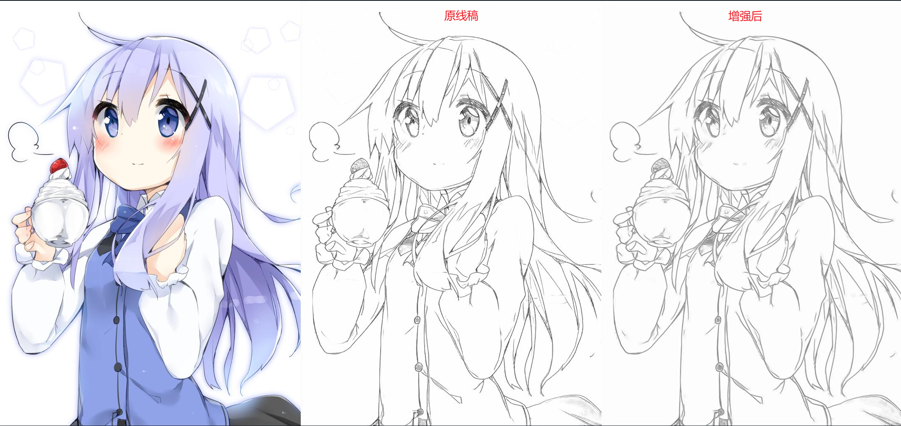
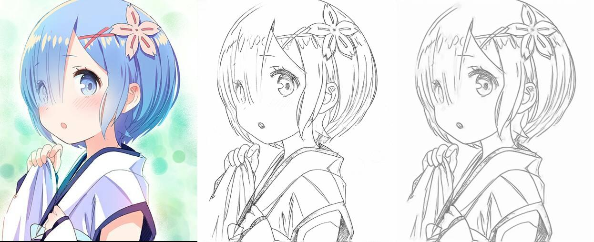

# image-to-line-drawing
本项目是用于将彩色图片转为线稿图，非常适合将二次元动漫图片转为线稿图。

提供两种风格，一种是直接转为线稿，另一种是将线稿进行增强，可以去噪和修正线条，让其更像笔画。




## 使用

### 2.1 环境准备

```
pip install -r requirements.txt
```

### 2.2 下载模型

将 `line-drawings.onnx` 和 `line-relifer.onnx` 模型文件下载放置在`model`文件夹下: 

| 方式       | 地址                                                         |
| ---------- | ------------------------------------------------------------ |
| modelscope | [download](https://modelscope.cn/models/mscoder/image-to-line-drawing-onnx/summary) |

### 2.3 使用代码

`image_to_line.py`

```python
import cv2
import os
import time
import numpy as np
import onnxruntime as ort

class ImageToLine:
    def __init__(self, model_path):
        self.line_drawings_path = os.path.join(model_path, "line-drawings.onnx")
        self.line_relifer_path = os.path.join(model_path, "line-relifer.onnx")
        if  not os.path.exists(self.line_drawings_path):
            raise ValueError(f"{self.line_drawings_path} not exists")
        if  not os.path.exists(self.line_relifer_path):
            raise ValueError(f"{self.line_relifer_path} not exists")
        self.line_drawings_session = ort.InferenceSession(self.line_drawings_path)
        self.line_relifer_session = ort.InferenceSession(self.line_relifer_path)

    def predict(self, image_path, save_path, enhance=True):
        img = cv2.imread(image_path)
        img = cv2.cvtColor(img, cv2.COLOR_BGR2RGB) / 255.0
        img = img.transpose(2, 0, 1).astype('float32')
        feeds = {'input': np.expand_dims(img, axis=0)}
        output = self.line_drawings_session.run(None, feeds)[0]
        if enhance:
            output_image = np.transpose(output, (0, 2, 3, 1))
            output_image = output_image * 2 - 1
            input_name = self.line_relifer_session.get_inputs()[0].name
            output_name = self.line_relifer_session.get_outputs()[0].name
            output = self.line_relifer_session.run([output_name], {input_name: output_image})[0]
            output_image = (output[0] + 1) / 2 * 255
            output_image = output_image.astype(np.uint8)
        else:
            output_image = output[0, 0]   
            output_image = (output_image * 255).astype(np.uint8) 
        cv2.imwrite(save_path, output_image)

if __name__ == '__main__':
    # 输入图片
    path1 = r'data/remu.jpg'
    # 输出图片
    save1 = r'data/remu-line2.jpg'
    cts = ImageToLine(model_path=r'model')
    cts.predict(path1, save1, enhance=True)  # 增强模式
```

## 样例




## 协议

代码开源协议是Apache-2.0 license。注意，这不包括图片。

## 感谢

[josephrocca/image-to-line-art-js](https://github.com/josephrocca/image-to-line-art-js)

[shuoGG1239/Paint2Sketch](https://github.com/shuoGG1239/Paint2Sketch)

[hepesu/LineRelifer](https://github.com/hepesu/LineRelifer)
